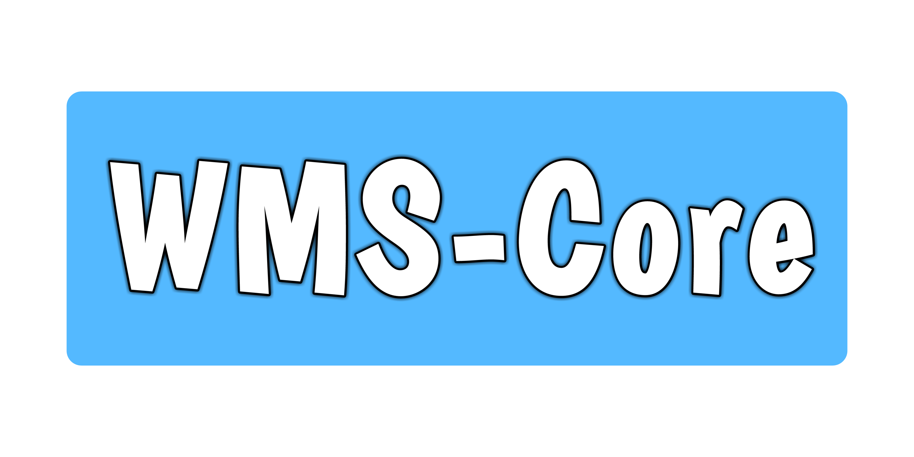

<section align="center">
    
    <h2 align="center">
        Wills Media Server, A flexible open-sourced media server
    </h2>
    <p align="center">:tada: <a href="https://github.com/WillsMediaServer/WMS-Core/">Homepage</a> - <a href="http://wills-media-server.rtfd.io">Documentation</a> - <a href="#faq">FAQs</a> :tada:</p>
</section>
<hr />


[](http://wills-media-server.readthedocs.io/en/latest/?badge=latest)

## Table of Contents
- [Installation](#installation)


### Installation

#### Prerequisites

- [ ] Python 3.5 or above
- [ ] ffmpeg
- [ ] A Computer with internet access

##### WMS-UI

- [ ] Nodejs
- [ ] NPM

To install Wills Media Server you will need to clone the repository and then change directory into it.
```
git clone https://github.com/WillsMediaServer/WMS-Core.git
cd WMS-Core
```
Its relatively simple from here on out to install the dependencies by either running:
```
pip install -r requirements.txt
```
or
```
pip install -r requirements.txt --target=/path/to/WMS-Core/libraries
```
(the second command should only be ran if you cannot or do not want to install the packages globaly)

next change directory into the libraries folder and clone the user interface into it

```
cd libraries
git clone https://github.com/WillsMediaServer/WMS-UI.git
```

and then you will need to download all the dependencies and build the latest version of the UI with:

```
cd WMS-UI
npm install
npm run build
```

and finaly run:
```
cd ../../
python start.py
```

Read our Documentation which can be found at [http://wills-media-server.readthedocs.io](http://wills-media-server.readthedocs.io) for more information.

### FAQ
